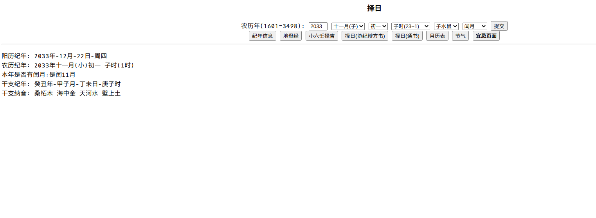

- govcl使用了[govcl](https://github.com/ying32/govcl)的开源库
- duit使用了[duit](https://github.com/mjl-/duit)的开源库(纯go写的)
- sciter为[go-sciter](https://github.com/sciter-sdk/go-sciter)的开源库
- zeri 一个简单的择日GUI [duit](https://github.com/mjl-/duit)
- ccal-web 简单的web页面 择日+小六壬择吉

- [在线体验](http://www.aquarianage.xyz:9090) 服务器到一月份结束

